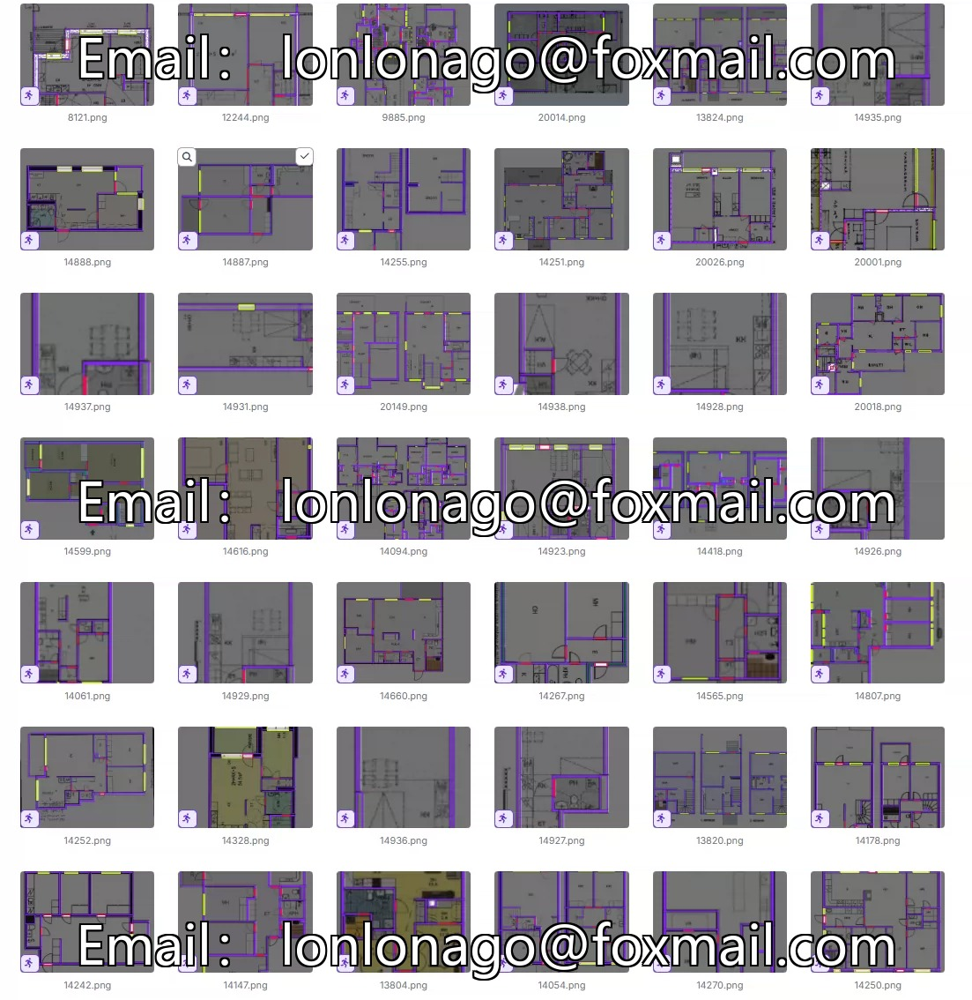
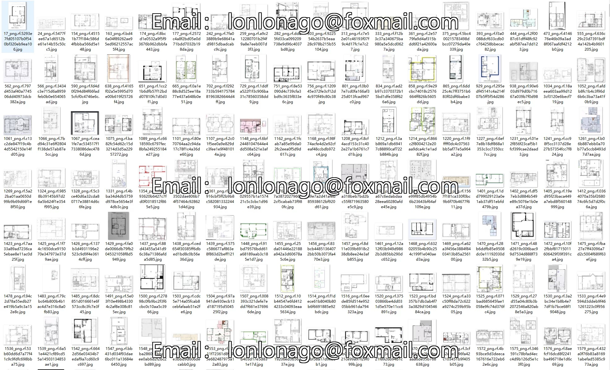
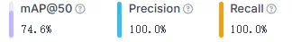
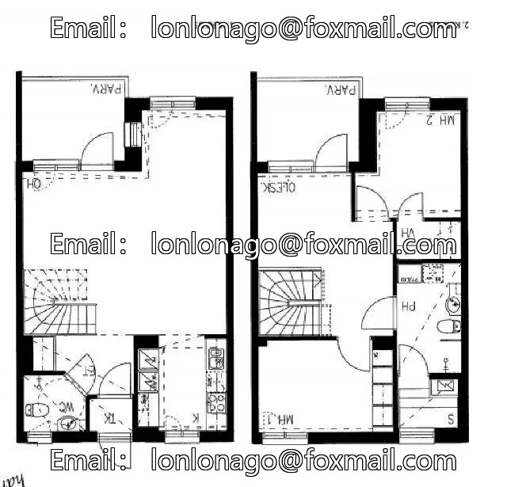
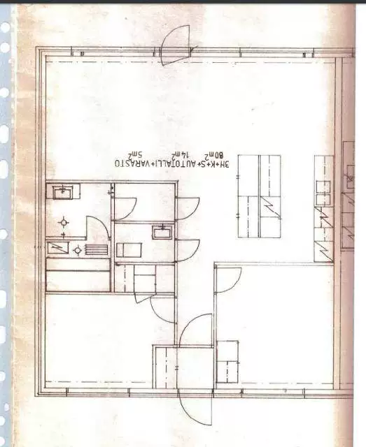

## Body

Model: YOLO

Dataset: Door/Wall/Window detection dataset in YOLO format

Total 4978 images, labeled with YOLO format and divided into training set (4178), test set (400), validation set (400)

Totally divided into 3 categories, namely 'door', 'wall', 'window'

Electronic virtual products sold without return or exchange.

## Images

item_1054470511846

Here is a pay link on Stripe ( https://buy.stripe.com/3cs8yP7sY87d0vu9AB ). Please contact me lonlonago@foxmail.com after funding $89, and I will send you a complete data files , thank you!

